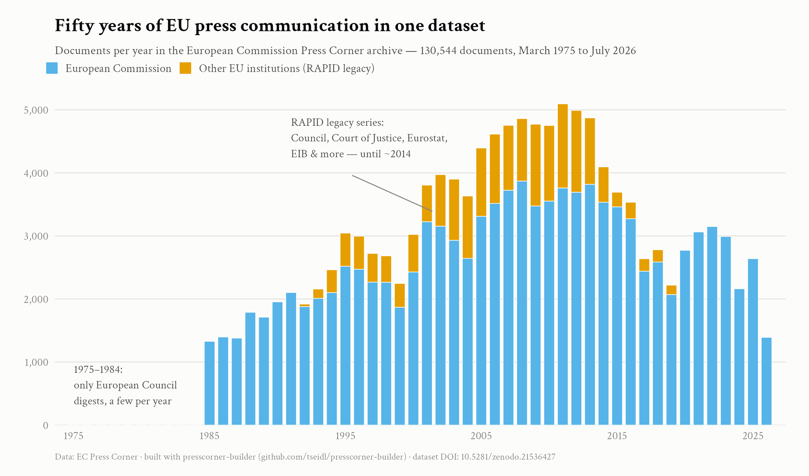

# presscorner-builder

[](https://doi.org/10.5281/zenodo.21538765)
[](https://doi.org/10.5281/zenodo.21536427)

> Build and maintain research-ready datasets from the European Commission Press Corner — every press release, speech, and statement since 1975, in one Parquet file.

The [Press Corner](https://ec.europa.eu/commission/presscorner) is the European Commission's press release database. `presscorner-builder` turns it into a clean, citable, always-updatable dataset for social science research. You can download the full pre-built corpus and top it up to today with one command, or define your own sub-corpus (by date, type, keyword, commissioner, or policy area) in a small YAML file.

No web scraping knowledge required. If you can run two commands in a terminal, you can use this.

<!-- STATS:OVERVIEW -->
**130,544 documents** · 1975-03-11 to 2026-07-24 · 32 document types · EN language edition
<!-- /STATS:OVERVIEW -->

The published dataset is refreshed every few months — and whatever its current cut-off, `presscorner update` brings your local copy to today in minutes.



## Quick start

```bash
pip install git+https://github.com/tseidl/presscorner-builder

presscorner download   # fetch the published full dataset (~460 MB)
presscorner update     # top it up from its cut-off date to today
```

That's it. `data/press-corner.parquet` now contains the complete corpus. Load it in R or Python:

```r
library(arrow)
docs <- read_parquet("data/press-corner.parquet")
```

```python
import pandas as pd
docs = pd.read_parquet("data/press-corner.parquet")
```

Already have a copy of the dataset from a colleague? Drop it in `data/` and run `presscorner update` — the tool reads the file itself to see where it stops and fetches only what's newer. Older versions produced by the predecessor scraper are migrated automatically.

## What's in the dataset

The Press Corner is the successor of **RAPID**, the Commission's press database running since the mid-1980s. The current website only advertises nine document types, but the archive behind the API still contains the full RAPID legacy — including press material from the Council, the Court of Justice, and other EU institutions, and European Council conclusions digests back to 1975. `presscorner-builder` collects all of it. To our knowledge this is not documented anywhere else.

<!-- STATS:TYPES -->
| Code | What it is | Documents | Coverage |
|---|---|---:|---|
| `IP` | Press release | 51,303 | 1985–2026 |
| `SPEECH` | Speech | 24,886 | 1985–2026 |
| `MEMO` | Memo / background note | 11,421 | 1985–2022 |
| `BIO` | Spokesperson's briefing (legacy) | 8,620 | 1985–2000 |
| `MEX` | Daily news (Midday Express) | 6,175 | 2001–2026 |
| `PRES` | Council of the EU press release (legacy) | 4,479 | 1992–2013 |
| `STATEMENT` | Statement | 3,944 | 2014–2026 |
| `STAT` | Eurostat release (legacy) | 3,409 | 2001–2019 |
| `PESC` | CFSP declaration (legacy) | 2,452 | 1994–2013 |
| `BEI` | European Investment Bank (legacy) | 2,106 | 2001–2014 |
| `CES` | European Economic and Social Committee (legacy) | 2,059 | 1995–2014 |
| `CJE` | Court of Justice press release (legacy) | 1,691 | 1994–2014 |
| `COR` | Committee of the Regions (legacy) | 1,223 | 1995–2014 |
| `P` | Early press note (legacy) | 960 | 1985–1995 |
| `QANDA` | Questions and answers | 945 | 2019–2026 |
| `AC` | News article | 937 | 2014–2026 |
| `FS` | Factsheet | 834 | 2015–2026 |
| `CLDR` | Calendar (legacy) | 715 | 2009–2025 |
| `AGENDA` | Weekly agenda (legacy) | 622 | 2005–2020 |
| `ECA` | Court of Auditors (legacy) | 470 | 1995–2014 |
| `EO` | European Ombudsman (legacy) | 330 | 2000–2014 |
| `DOC` | European Council conclusions digest (legacy) | 294 | 1975–2013 |
| `OLAF` | European Anti-Fraud Office (legacy) | 183 | 2001–2015 |
| `EDPS` | European Data Protection Supervisor (legacy) | 126 | 2005–2014 |
| `WM` | Week in the media (legacy) | 105 | 2014–2021 |
| `INF` | Infringement decisions | 71 | 2019–2026 |
| `READ` | Read-out | 57 | 2020–2026 |
| `DN` | Daily news bulletin (legacy) | 55 | 2005–2005 |
| `EPSO` | European Personnel Selection Office (legacy) | 35 | 2003–2009 |
| `COUNTRY` | Country information (legacy) | 21 | 2019–2022 |
| `ETW` | Enterprise Europe Network (legacy) | 14 | 2011–2012 |
| `TRANS` | Transcript (legacy) | 2 | 2012–2012 |
<!-- /STATS:TYPES -->

Two honest caveats:

1. **The legacy series ended around 2013–2015**, when the other institutions launched their own newsrooms. For those institutions this is a historical archive, not ongoing coverage. The Commission's own types (`IP`, `SPEECH`, `STATEMENT`, `MEX`, `QANDA`, …) are current and continuously updated.
2. **Rich metadata is a recent phenomenon.** Policy areas, commissioner attribution, places, and subtitles were introduced with the modern content system and never backfilled. What is consistent across the whole archive is the core: reference, date, title, and full text. Plan your research design accordingly:

<!-- STATS:ERA -->
| Field | 1980s | 1990s | 2000s | 2010s | 2020s |
|---|---|---|---|---|---|
| Full text | 100% | 100% | 100% | 100% | 98% |
| Subtitle | 0% | 0% | 0% | 27% | 89% |
| Summary | 0% | 0% | 0% | 15% | 32% |
| Policy areas | 0% | 0% | 0% | 27% | 100% |
| Spokespersons | 0% | 0% | 0% | 15% | 56% |
| Commissioners | 0% | 0% | 0% | 31% | 85% |
| Place | 0% | 0% | 0% | 39% | 89% |
<!-- /STATS:ERA -->

*Why is full text not 100% in the 2020s? Almost all of the gap is factsheets (`FS`): these are designed as visual PDF documents, so their pages have no body text to extract. Every one of them carries a working `pdf_url` pointing to the actual content.*

## Building your own corpus

For a defined sub-corpus, write a small YAML file (`presscorner init` creates a template):

```yaml
metadata:
  project_name: "Von der Leyen climate speeches"

data:
  mode: descriptive
  document_types: [SPEECH, STATEMENT]
  start_date: 2019-12-01
  keywords: ["climate"]

output:
  output_directory: ./output
  dataset_name: vdl-climate
```

```bash
presscorner build config.yaml
```

This produces `output/vdl-climate.parquet` plus a metadata sidecar recording exactly how the corpus was built (config hash, package version, run date) — share the YAML in your replication package and the corpus is fully reproducible. If you already know which documents you want, use `mode: fixed` with a list of reference numbers instead.

## Keeping the dataset complete: `audit`

Scrapes fail silently: connections drop, servers hiccup, and you end up with holes you never notice. `presscorner-builder` treats this as a first-class problem:

- All fetching happens in **calendar-month windows**, so an interruption costs at most one month, and every run is resumable — failed windows and documents are remembered and retried on the next run.
- `presscorner audit` compares, month by month, how many documents the EC API reports against how many your local file contains, and prints any mismatch. `presscorner audit --fix` re-fetches the deficient months.

```bash
presscorner audit          # find holes
presscorner audit --fix    # repair them
```

(This machinery found and repaired ~3,700 silently missing documents in the predecessor scraper's dataset, including four entirely missing months.)

## Commands

| Command | What it does |
|---|---|
| `presscorner download` | Fetch the published full dataset (shows version and cut-off date) |
| `presscorner update` | Incrementally extend your local dataset to today |
| `presscorner build config.yaml` | Build a YAML-defined sub-corpus |
| `presscorner audit [--fix]` | Check (and repair) completeness against the API |
| `presscorner status` | Show counts, date range, cut-off, pending retries |
| `presscorner export --by-type` | Optional per-type Parquet files (`speeches.parquet`, …) |
| `presscorner init` | Write an example YAML config |

All commands take `--data-dir` (default `./data`) and are safe to interrupt and re-run.

## Data schema

One row per document.

| Column | Description |
|---|---|
| `document_id` | Unique ID (`ip_26_301`) |
| `reference` | Official reference (`IP/26/301`) |
| `doc_type`, `doc_type_name` | Type code and label |
| `title`, `subtitle`, `summary` | Title fields (subtitle/summary mostly post-2010) |
| `date` | Publication date (YYYY-MM-DD) |
| `publish_datetime` | Exact publication timestamp (recent documents only) |
| `place` | Location, e.g. "Brussels" (recent documents only) |
| `language`, `original_language` | Language edition and original language |
| `commissioners` | Attributed commissioner(s) — the speaker, for speeches (recent only) |
| `spokespersons` | Press contacts listed on the document (recent only) |
| `policy_areas`, `policy_codes` | Policy area labels and codes (recent only) |
| `full_text` | Complete text, HTML stripped |
| `url`, `pdf_url` | Links to the document page and PDF |
| `detail_ok` | Whether the full document fetch succeeded (a few always fail server-side) |
| `scraped_at` | Retrieval timestamp |

Multi-valued fields are `"; "`-joined strings. By default the English edition is collected; `update`/`build` accept other language codes but the published dataset is English.

## Dataset versioning and citation

The full dataset is published on Zenodo with a versioned DOI; versions are named by cut-off (`v2026.07` = complete through July 2026). `presscorner download` always tells you which version you got. Whatever the published version, `presscorner update` brings your local copy to today.

If you use the dataset or the package, please cite both:

```bibtex
@dataset{seidl_presscorner_data,
  author    = {Seidl, Timo},
  title     = {EC Press Corner Complete Document Dataset (1975--2026)},
  publisher = {Zenodo},
  doi       = {10.5281/zenodo.21536427},
  note      = {Dataset version v2026.07}
}

@software{seidl_presscorner_builder,
  author = {Seidl, Timo},
  title  = {presscorner-builder: research-ready datasets from the EC Press Corner},
  url    = {https://github.com/tseidl/presscorner-builder},
  doi    = {10.5281/zenodo.21538765}
}
```

The dataset DOI above is the Zenodo *concept DOI*, which always resolves to the latest version. For reproducibility, cite the *version DOI* of the release you actually used (listed on the [Zenodo record](https://zenodo.org/records/21536428); for v2026.07 it is `10.5281/zenodo.21536428`) and state the version number.

## For maintainers

- Refresh cycle: every few months, run `presscorner update && presscorner audit --fix`, then `python scripts/update-readme-stats.py`, publish the new parquet as a Zenodo version, and update `dataset-manifest.json` (version, cut-off, URL, sha256).
- Scraping is polite by design: ≥1s request delay, honest User-Agent, exponential backoff, no parallel requests. Please keep it that way.

## Authors

- **Timo Seidl** — Assistant Professor, Technical University of Munich
- **Claude (Anthropic)** — Co-author (software design and implementation). Built with [Claude Code](https://claude.ai/code).

## License

MIT. The documents themselves are © European Union — reuse is governed by the [Commission's reuse policy](https://commission.europa.eu/legal-notice_en) (CC BY 4.0 for most content).
